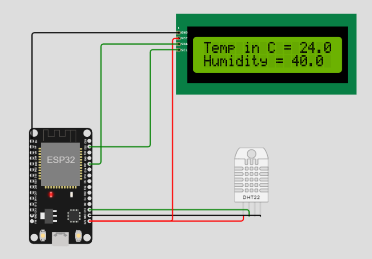

# ESP32 Based Iot Weather Station
## Overview
An ESP32-based IoT weather station that senses the temperature and humidity, the data is then displayed on an LCD and published to an [MQTT](https://en.wikipedia.org/wiki/MQTT) broker.

>You can run the simulation [here](https://wokwi.com/projects/347403965580706386).



## The Hardware
To realize this project you will need:
- ESP32: A low-cost, low-power system on a chip microcontrollers with integrated Wi-Fi.
- DHT22: A low-cost digital temperature and humidity sensor.
- I2C LCD 16x2: Displays 16 characters per line and there are 2 such lines.
- Breadboard: A construction base used to build semi-permanent prototypes of electronic circuits.
- Jumper wires: An electric wire that connects remote electric circuits used for printed circuit boards.

## The Software
>The code is written in [MicroPython](https://micropython.org/).

The workflow is simple and can be achieved by following the steps below:
### 1. Connect to the Wi-Fi
You can use the [network](https://docs.micropython.org/en/latest/library/network.html) module to do so.
```python
sta_if = network.WLAN(network.STA_IF)
sta_if.active(True)
sta_if.connect('your_network_name', 'your_network_password')
```
### 2. Connect to the MQTT Broker
For simplicity, you may use a public broker such as [HiveMQ](https://www.hivemq.com/public-mqtt-broker/) or [EMQX](https://www.emqx.com/en/mqtt/public-mqtt5-broker) and the [Umqtt.Simple](https://pypi.org/project/micropython-umqtt.simple/) package for the connection.

```python
MQTT_CLIENT_ID = "micropython-weather-demo"
MQTT_BROKER    = "broker.mqttdashboard.com"
MQTT_TOPIC     = "esp32-weather-station-2023"
MQTT_USER      = ""
MQTT_PASSWORD  = ""

client = MQTTClient(
    MQTT_CLIENT_ID,
    MQTT_BROKER,
    user=MQTT_USER,
    password=MQTT_PASSWORD
)

client.connect()
```
### 3. Connect the LCD and DHT22 sensor to the ESP32
First you need to configure the pins.
```python
# LCD
AddressOfLcd = 0x27 # the default I2C address
i2c = I2C(scl=Pin(22), sda=Pin(21), freq=400000)
lcd = I2cLcd(i2c, AddressOfLcd, 2, 16)

# DHT
sensor = dht.DHT22(Pin(15))
```
Write a function to display the data on the LCD.
```python
def displayToLCD(upperText, lowerText):
    # Row 1
    lcd.move_to(0, 0)
    lcd.putstr("Temp in C = " + str(upperText))

    # Row 2
    lcd.move_to(0, 1)
    lcd.putstr("Humidity = " + str(lowerText))
```
### 4. Start sensing, displaying, and publishing the data
You can now run the application infinitely, every second, it will sense the weather and compare it to the previous one, in case of changes, the new data will be displayed and published, otherwise the application logs that there are no changes.

```python
prev_weather = ""

while True:
    sensor.measure()

    displayToLCD(sensor.temperature(), sensor.humidity())

    payload = ujson.dumps({
        "temp": sensor.temperature(),
        "humidity": sensor.humidity(),
    })

    if payload != prev_weather:
        client.publish(MQTT_TOPIC, payload)
        prev_weather = payload
    else:
        print("No change, won't publish")

    time.sleep(1)
```
Check the full code [here](main.py).

## An MQTT Websocket Client
Your mini weather station is displaying and publishing data to a broker but unless you are sitting next to it, you have no clue about the weather.

It would be cool if you could make use of this data anywhere in the world by building your own Web (or Mobile) Application that allows you to subscribe and get real-time updates.

Interested? I have created a [Laravel MQTT client](https://github.com/OussamaMater/Laravel-MQTT-Client) that could be insightful.